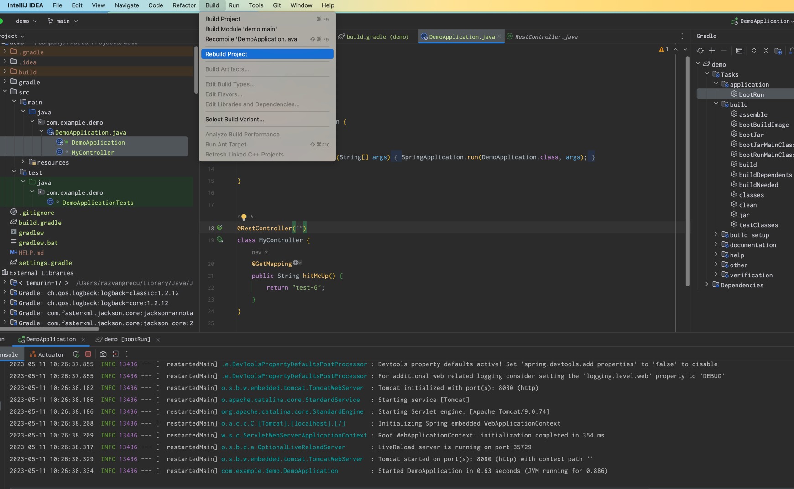

# Getting Started

Using intellij, after making changes, you may want to:

This will actually restart your server, so in case it takes long, it might be problematic.
In case your project is larger, it may work if you use the `Recompile <filename>` option.

Using purely gradle, you may need to do it in 2 terminals or by using 2 tasks:
1. `gradle assemble --continuous` OR `gradle build --continuous -x test`
2. `gradle bootRun`

It may be possible that in more recent versions of spring and the dev tools you can just:
1. `gradle bootRun --continuous`
